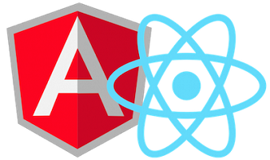
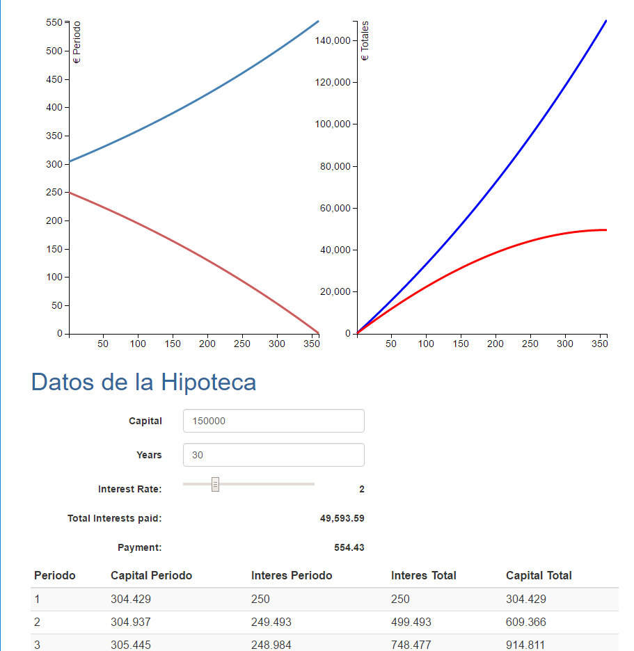

- title : Angular1 vs React vs Angular2
- description : Comparison of JavaScript frameworks
- author : Roberto Aranda
- theme : night
- transition : default

***
- data-background : images/Dotnet16-9.png
- data-background-repeat : no-repeat
- data-background-transition: none
- data-background-position: 50% 50%

***

## Migrando de Angular 1 a React y a Angular 2!?

[@glomenar](https://twitter.com/glomenar)

***

## Roberto Aranda 
- *Lead Developer* en *Sequel Business Solutions*
    - SQL
    - Backend
    - Front end apasionado
- 10+ años desarrollando software

[@glomenar](https://twitter.com/glomenar)

[ese.rober@gmail.com](mailto:ese.rober@gmail.com)

***
- data-transition: none 

<section data-markdown>
    
</section>

***
- data-background : images/cross.png
- data-background-repeat : no-repeat

# Agenda

- Angular 1 
- React     
- Angular 2 

***
- data-transition: none

Una historia

***
2014

***
# Hypotheke

***
### Hypotheke?

[link](https://hypotheke.herokuapp.com/)

***
# AngularJS 1

- Superheroic JavaScript MVVM Framework
- Creado por *Google* es uno de los frameworks de JavaScript más usados
- Tiene todo lo necesario para crear una *Single Page Application*
- Usa un *event loop* conocido como *$digest loop* para aplicar cambios

***
# Show me the Code

***
2016

***
# React

- A JavaScript library for building user interfaces
- Creado por *Facebook* es una apuesta segura estos días
- Declarativo y basado en Componentes
- Usa el concepto de *Virtual DOM* para minimizar el *rendering*

***
# Implicaciones
<section data-markdown>
    
</section>

***

# Javascript Fatigue

Saul: “How’s it going?”

Me: “Fatigued.”

Saul: “Family?”

Me: “No, Javascript.”

***

# Create-React-App

Paquete NodeJs para crear aplicaciones con React, 
incluye el *transpilador*, *bundler*, *hot-realoading*, *server*, etc. con

*Zero Configuration*

***

## Vamos a Verlo

***

### The Reality of a Developer's Life 

**When I show my boss that I've fixed a bug:**
  

  
**When your regular expression returns what you expect:**
  

  
*from [The Reality of a Developer's Life - in GIFs, Of Course](http://server.dzone.com/articles/reality-developers-life-gifs)*

